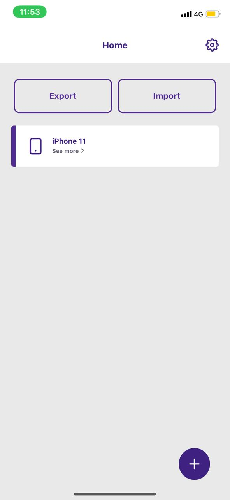
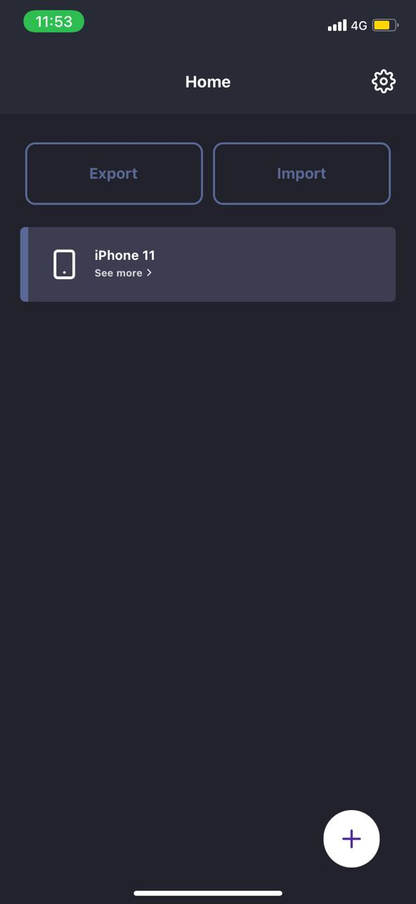
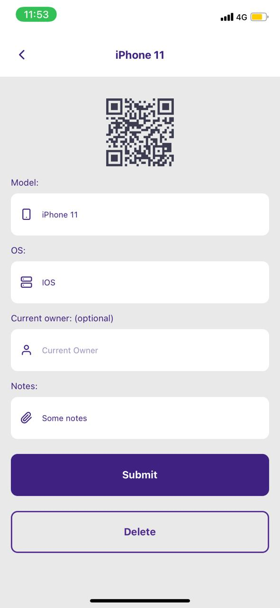
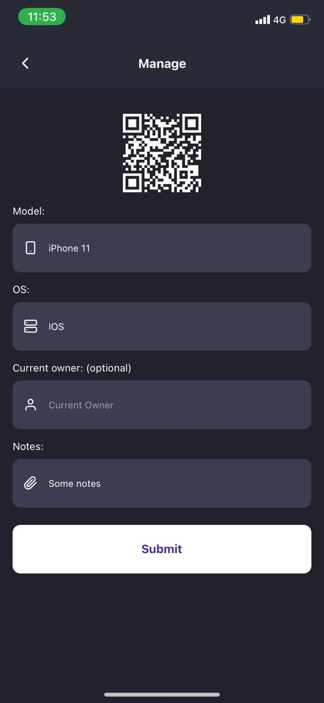

# 📱 Proximus Device Management
 Proximus Challenge for react native developer
 
Run in your device via ExpoGo: https://expo.dev/@danielj06/proximus


[](https://github.com/danielj06)
[](#)

# :eye: Preview

<div>
  
  
    
  
</div>

# :pushpin: Table of Contents

* [Features](#brain-features)
* [Installation](#construction_worker-installation)
* [Technologies](#computer-technologies)

# :brain: Features

* List/Add(Multiples)/Update/Delete devices
* Generate QRcode for each device
* Theme switcher
* Import/Export list of devices as .csv
* Unit test

⚠️ Import/export functionality requires ICloud capability on IOS devices, if you are using emulators, open and run the project through XCode with a developer account

# :construction_worker: Installation

Run this: ``` yarn install ```
Then: ``` cd ios/ && pod install ```
Then: ``` yarn start ```

# :computer: Technologies

* Expo
* Typescript
* Axios
* Styled-components
* Reactotron
* Eslint
* Prettier
* Jest
* Yup
* Formik
* Redux
* React Navigation V5

# Structure

src
 - components
 - config
 - routes
 - service
 - store
 - utils
 - pages
 - routes
 - service
 - utils
